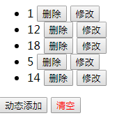

## 列表简单的增删，改的话是直接赋值



点击修改是直接修改值，这里需要注意的有两点：
+ 第一是index，直接修改页面没反应，比如全部删除后再添加，页面不会显示全部清除这一步，但是如果清楚后添加，你会看到页面之有刚添加的那个。
+  第二就是这里的改值因为index的原因是直接用splice替换了新的值，所以是直接赋值

```
js
<div id="app">
		<h2>{{title}}</h2>
		<ul>
			<li v-for="(n,index) in arr1" :key="index">
				{{n}}   
				<button @click="del(index)">删除</button>
				<button @click="edit(index)">修改</button>
			</li>
		</ul>
		<button @click="add">动态添加</button>
		<button @click="clear" style="color:red">清空</button>
	</div>
var vm = new Vue({
			el: '#app',
			data:{
				title: '不凡学院',
				arr1: [1,2,3],
			},
			methods: {
				add:function(){
					this.arr1.push(Math.floor(Math.random()*20));
				},
				del:function(index){
				  this.arr1.splice(index, 1);
				},
				edit: function(index){
					//为什么明明根据下标修改了 但是页面没反应?
					// this.arr1[index] = Math.floor(Math.random()*20);
					//可以通过替换的形式 修改数组下标 
					this.arr1.splice(index,1,Math.floor(Math.random()*20));
					console.log(this.arr1);
				},
				clear: function(){
					this.arr1 = [];
					//数组清空的另一种方式: arr.lenght = 0;
					//注意:跟根据下标修改数组值一样,修改数组长度的话,vue也检测不到更新.但实际上数组是被改变了的,只是不会响应式的在页面中显示.
					// this.arr1.length = 0 ;
				}
			}
		});
	</script>
```